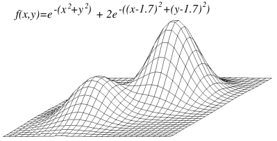

# Python Optmizer (3 dimensional)

A hill climbing algorithm in python.
 
How to find a global maximum or minimum.
  
p.s.: this is one of my first algorithms. I'm sorry for the bad style. I may be working on a Version 2 soon. ;D

:exclamation: This algorithm may encounter a local maximum or minimum [read about](https://en.wikipedia.org/wiki/Maxima_and_minima), and may be trapped there.

A good strategy could be run the code several times, starting from different points randomly chosen.
 
You register all optimal solutions for each run, and then you get the best ove all solutions.

Example of 3 dimension topology:

## Inspiration
https://en.wikipedia.org/wiki/Hill_climbing

## Dependencies
> matplotlib.pyplot

## Improvements (that you could do :D )
* ~Plot the 3D surface~
* Plot the climbing path in 3D too over the surface
* Implement the several random runs option as a parameter
* Make the radial function more inttelligent (if you pay attention, the same points may be evaluated multiple times).
  * A solution here could be an knowledge base which would save already evaluated points to this base. This would prevent recalculating.
